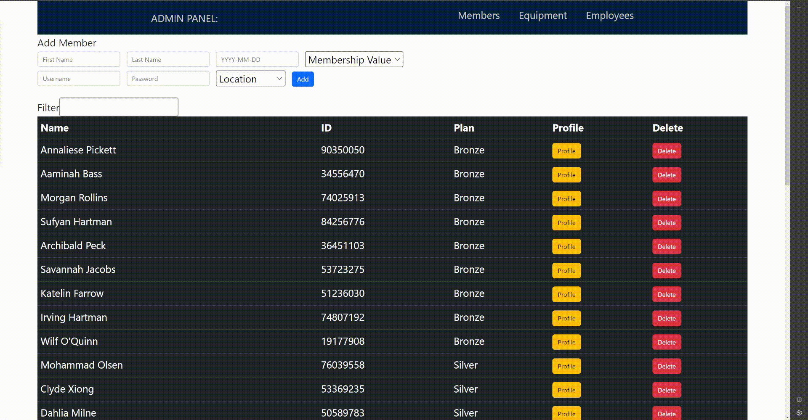
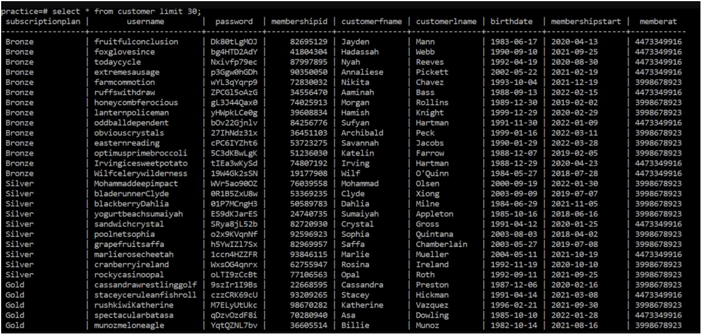

# Database, Admin Login, and Filter

### This is a proof-of-concept site showing of ground-up built UI with Database.

## **Distinct Features**

- Admin Panel
- **Instant** Filtering of Database
- Ability to update database from interface via CRUD
- User Interface

## **To Run**

Open two seperate terminals:
/Code/Server
/Code/Client

Then, in both terminals, run the follow commands:

    npm install
    npm start

PORT will be shown in Server terminal, and webpage will pop up running on local computer.

## **To Login**

Select an employee from the employee database and login with their credentials. You will then have access to the admin panel.

## **Instant Filtering**

Here, below is the Admin Panel and an example of _instant_ filtering.

## **Final Notes**

Adding members is located at the top.

To edit a profile, click the edit button and the user's interface will pop up. Edit and it will apply immediately.
     

### Extra Info:

This is an admin-panel for a theoritical gym membership system. The system
contains the members, employees, the location(s), and an amenities
table that contains data on equipment.  
For the tech stack, JavaScript React was used for the front end, Postgres
for the database, and Node and Express for the Server logic.  
There are multiple SQL queries. From various types of gets that either
retrieve partial views, etc. To UPDATE requests that can change entire
or partial sections of the data tables, to adding members or employees
and even deleting rows in the employees or member locations.  
There are constraints on what types of data can be inputted. The
JavaScript logic protects against invalid data inputs when trying to add
member. Also, there is login verification where only employees are
verified as admins can have access to the admin panel. On top of all
that, Primary Constrained IDs are created by auto-generation and are
compared to the database to ensure uniqueness before being
submitted.  
Also, one-to-many tables are connected to each other via foreign
keys. Table normalization was used to ensure that were no redundancy
in the database.
Lastly, there is also protection against SQL injection. This is because the
server code takes whatever is inputted and turns it into a variable for
SQL before passing it into the command itself.

# Example of database:

